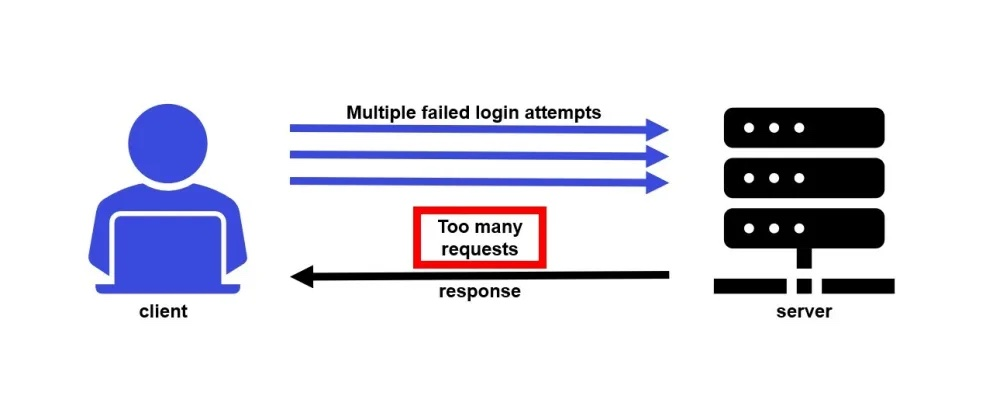

# Throttling in Django

### DEV Session

### CODIUM

<div class="abs-br m-6 flex gap-2">
  <button @click="$slidev.nav.openInEditor()" title="Open in Editor" class="text-xl icon-btn opacity-50 !border-none !hover:text-white">
    <carbon:edit />
  </button>
  <a href="https://github.com/earthpyy/throttling-in-django-slide" target="_blank" alt="GitHub"
    class="text-xl icon-btn opacity-50 !border-none !hover:text-white">
    <carbon-logo-github />
  </a>
</div>

---
layout: quote
---

# What is Throttling?

<br>

## " **Throttling** is the process of limiting the number of API requests a user can make in a certain period.[^1] "

**Rate Limit** is one of many use cases of Throttling.

<br>
<br>
<br>
<br>

[^1]: [What is API Throttling?](https://www.tibco.com/reference-center/what-is-api-throttling)

---

# How does it works?

<br>

 [^1]

[^1]: [Reference](https://dev.to/mattdclarke/how-to-rate-limit-a-login-route-in-express-using-node-rate-limiter-flexible-and-redis-1i1k)

---

# How Django REST identifies the user

1. By IP (`AnonRateThrottle`)
2. By logged user (`UserRateThrottle`)

   - If no logged user, fallback to identify the user from _IP_ instead.

---
layout: two-cols
---

# Simple global config

<br>

## `AnonRateThrottle`

Allows 10 requests per minute by IP.

```python
# settings.py

REST_FRAMEWORK = {
    'DEFAULT_THROTTLE_CLASSES': [
        'rest_framework.throttling.AnonRateThrottle',
    ],
    'DEFAULT_THROTTLE_RATES': {
        'anon': '10/min',
    }
}
```

<br>

Anyway, you can also set throttle class in each view using <kbd>throttle_classes</kbd> attribute.

::right::

# &nbsp;

<br>

## `UserRateThrottle`

Allows 100 requests per second by logged user

```python
# settings.py

REST_FRAMEWORK = {
    'DEFAULT_THROTTLE_CLASSES': [
        'rest_framework.throttling.UserRateThrottle',
    ],
    'DEFAULT_THROTTLE_RATES': {
        'user': '100/second',
    }
}
```

---

# Multiple Throttling settings

<br>

```python
# throttle.py
class BurstRateThrottle(UserRateThrottle):
    scope = 'burst'

class SustainedRateThrottle(UserRateThrottle):
    scope = 'sustained'
```

```python
# settings.py

REST_FRAMEWORK = {
    'DEFAULT_THROTTLE_CLASSES': [
        'example.throttles.BurstRateThrottle',
        'example.throttles.SustainedRateThrottle',
    ],
    'DEFAULT_THROTTLE_RATES': {
        'burst': '60/min',
        'sustained': '1000/day',
    }
}
```

This setting will allow the maximum of 60 requests per minute and 1000 per day.

---

# Scoped Throttling

```python
# views.py

class OTPRequestView(APIView):
    throttle_scope = 'otp_request'

class LoginView(APIView):
    throttle_scope = 'login'
```

```python
# settings.py

REST_FRAMEWORK = {
    'DEFAULT_THROTTLE_CLASSES': [
        'rest_framework.throttling.ScopedRateThrottle',
    ],
    'DEFAULT_THROTTLE_RATES': {
        'otp_request': '5/min',
        'login': '10/min',
    }
}
```

This setting will allow 5 OTP requests per minute, but 10 requests for login request.
